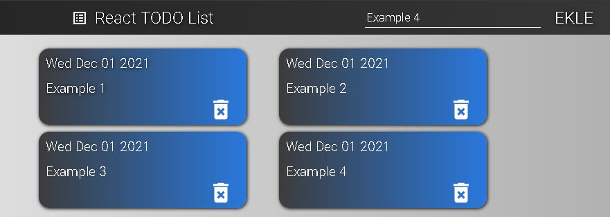

# React Basit TODO List
1. React Stil Verme
2. React Props
3. React Bileşenler 
4. React States 

## Modülleri Yükleme 
    npm install

## Çalıştırma 
    npm start

## Derleme 
    npm run build

## Lisans 

[MIT Lisansı](LICENSE)

